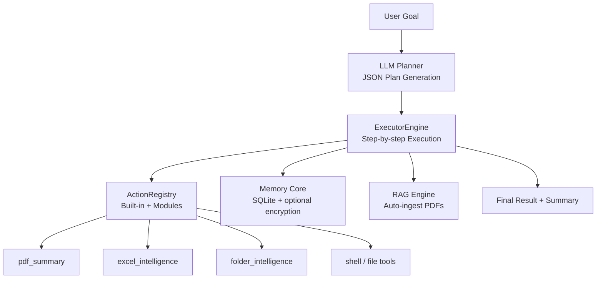

# LLM-Agent Hub

**LLM-Agent Hub** is a lightweight, local-first orchestration engine for LLM + RAG + modular automation.  
It runs entirely on your machine, executes goals through multi-step planning, handles documents, operates tools, and produces structured results — fully local and privacy-safe.
- 🧠 **LLM-driven planning** (Heavy Executor)  
- ⚙️ **Tool execution** (filesystem, shell, modules)  
- 🧩 **Modular plugin system** (PDF, Excel, Folder Intelligence)  
- 🔒 **Local-only**: no cloud data storage  
- 📚 **RAG pipeline** with auto-ingest  
- 🪶 **FastAPI** backend with clean APIs  
- 🧱 **SQLite memory engine** (encrypted optional)
- --

## Why LLM-Agent Hub?

LLM models can generate text — but they cannot **act**.

LLM-Agent Hub turns an LLM into an **action engine**:

1. You provide a **goal**  
2. The system generates a **plan** (JSON steps)  
3. Executes steps using tools/modules  
4. Returns **structured results** + **summary**

Example:

> “Analyze the folder and summarize its contents.”

→ Engine chooses: `folder_analyze`  
→ Executes  
→ Returns insights, anomalies, structured stats  

All **locally**, without sending your documents anywhere.
- --

## Architecture (High-Level)



## Features

🧠 Heavy Executor

Turns a natural-language goal into structured executable steps.

Planner (LLMPlanner)
- Generates JSON plans from natural-language goals
- Repairs invalid or broken JSON
- Aware of available actions
- Does not fail on unknown actions
- Produces structured and consistent output

Example plan:

{
  "steps": [
    { "id": 1, "action": "folder_analyze", "args": {} }
  ]
}

ExecutorEngine
- Executes each step safely
- Tracks statuses
- Supports retry and recovery
- Collects result or error per step
- Produces a unified ExecutionResult:

{
  "status": "success",
  "success": true,
  "steps": [...],
  "summary": "All steps executed successfully.",
  "error": null
}
- --

Modular Plugin System

Modules live under:

modules/
  <module_name>/
    manifest.json
    actions.py
    logic.py

Eligible modules are auto-loaded at startup.

Included Modules

1. PDF Intelligence (pdf_summary)
- pdf_list_docs
- pdf_read
- pdf_summarize

Example:

{"goal": "Summarize the PDF contract.pdf"}
- --

2. Excel Intelligence (excel_intelligence)
- excel_read
- excel_analyze

Requires: openpyxl

Example:

{"goal": "Analyze sales.xlsx and summarize key findings"}
- --

3. Folder Intelligence (folder_intelligence)
- folder_list
- folder_stats
- folder_analyze

Example:

{"goal": "Analyze the folder and summarize its contents."}
- --

Tools API
- /api/tools/run_shell — safe shell commands
- /api/tools/read_file
- /api/tools/list_dir

Unified schema:

{
  "status": "success",
  "tool": "run_shell",
  "result": "..."
}
- --

Installation

1. Clone & install dependencies

git clone https://github.com/<your-username>/llm-agent-hub.git
cd llm-agent-hub

python3 -m venv .venv
source .venv/bin/activate   # Windows: .venv\Scripts\activate
pip install -r requirements.txt

2. Configure .env

OPENAI_API_KEY=your_key_here
OPENAI_MODEL=gpt-4o-mini
CHAT_MODEL=gpt-4o-mini

HUB_ENCRYPT_KEY=

PORT=8081
DEBUG=1
LOG_LEVEL=info

Optional: generate encrypted memory key

python3 -c "from cryptography.fernet import Fernet; print(Fernet.generate_key().decode())"
- --

3. Run the server

./run.sh start

Check status:

curl http://127.0.0.1:8081/status
- --

Usage

Execute a goal

curl -X POST http://127.0.0.1:8081/api/executor/run \
- H "Content-Type: application/json" \
- d '{"goal": "Analyze the folder and summarize its contents."}'

Response:

{
  "status": "success",
  "steps": [...],
  "summary": "All steps executed successfully."
}
- --

Roadmap
- Web UI (Finder-style dashboard)
- Installer (macOS / Windows / Linux)
- Additional business modules:
- Email Intelligence
- CRM Intelligence
- Log Analyzer
- API Automation
- Parallel execution
- Long-running tasks
- Workspace-level configuration
- --

License

LLM-Agent Hub is released under the GNU GPL v3 license.

This means:
- You may use and modify the code for personal, educational, and research purposes.
- If you distribute modified versions, you must open-source them under the same license.
- Commercial/proprietary use requires a separate commercial license.

© 2025 Aleksandr Ladygin
For enterprise licensing: ladygin.a@icloud.com

```
